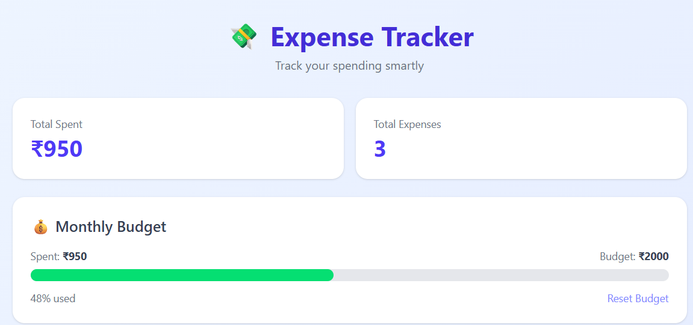
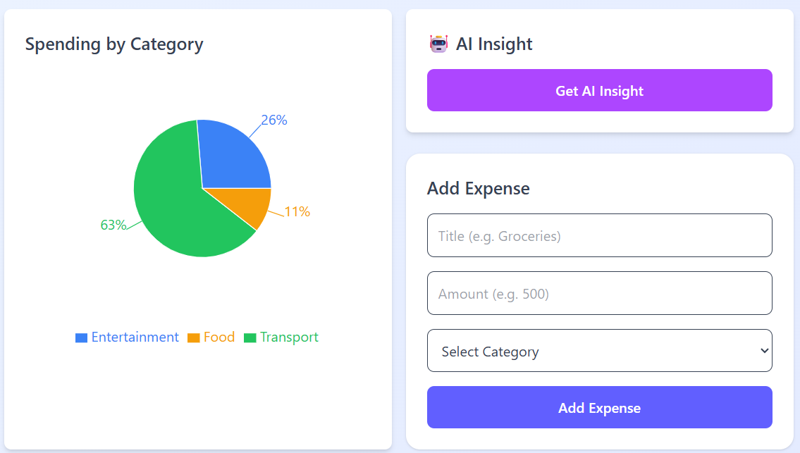
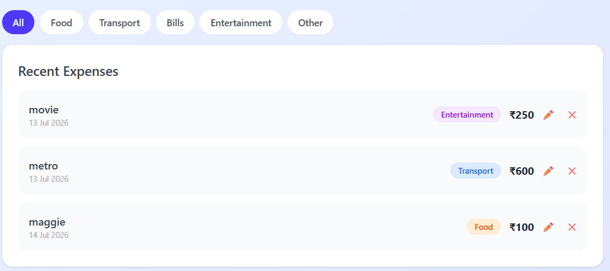

# 💸 Expense Tracker

A modern full-stack expense tracking application built with the MERN stack that helps users manage expenses, monitor monthly budgets, visualize spending patterns, and receive AI-powered financial insights.

---

## 🚀 Features

- 📊 Interactive Dashboard
- ➕ Add New Expenses
- ✏️ Edit Existing Expenses
- ❌ Delete Expenses
- 🔍 Filter Expenses by Category
- 💰 Monthly Budget Tracking
- 📈 Category-wise Spending Analysis (Pie Chart)
- 🤖 AI-Powered Spending Insights
- 📱 Responsive User Interface

---


---

✔ Add Expenses
✔ Edit Expenses
✔ Delete Expenses
✔ Category Filtering
✔ Budget Tracking
✔ Pie Chart Analytics
✔ AI Spending Insights
✔ Responsive Dashboard

---

## 📷 Screenshots

### Dashboard Overview



---

### Analytics & AI Insights



---

### Expense Management



---

## ⚙️ Installation

Clone the repository

```bash
git clone https://github.com/AshokYadav186/expense-tracker.git
```

Install dependencies

### Backend

```bash
cd backend
npm install
```

### Frontend

```bash
cd frontend
npm install
```

Start Backend

```bash
npm run dev
```

Start Frontend

```bash
npm start
```

## 👨‍💻 Author

Ashok Yadav

GitHub: https://github.com/AshokYadav186
