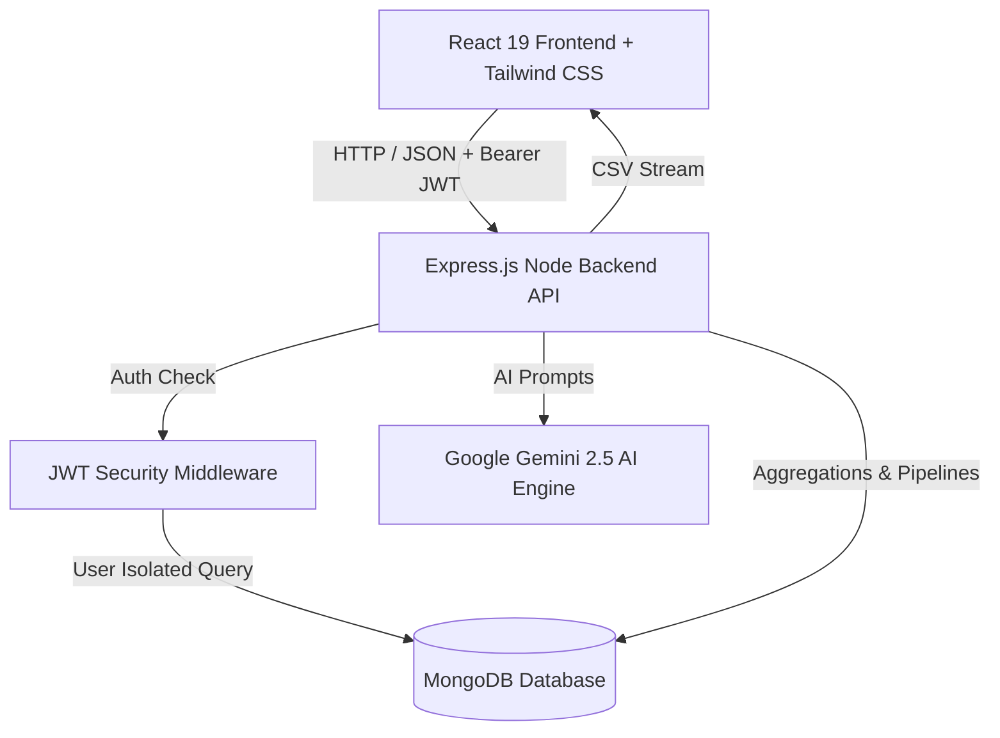

# 💸 Smart Expense Tracker & AI Financial Advisor

> A enterprise-grade, production-ready full-stack MERN application built with React 19, Node.js, Express, MongoDB, Google Gemini AI, Docker, and GitHub Actions CI/CD. Features multi-tenant JWT authentication, MongoDB aggregation pipelines, real-time analytics, and automated reporting.

---


---

## 🏗️ System Architecture



---

## ⚡ Core Engineering Features

- 🔐 **Stateless Multi-Tenant JWT Authentication**: Secure user registration & login using `jsonwebtoken` and `bcryptjs` salted password hashing with route guard middleware.
- ⚡ **MongoDB Aggregation Pipelines**: High-performance database query grouping (`$group`, `$sum`, `$avg`, `$match`) for real-time category breakdowns, average transaction costs, and monthly spending trends.
- 🤖 **AI Financial Advisor (Google Gemini 2.5)**: Personalized spending habit analysis, budget anomaly detection, and actionable saving recommendations.
- 📊 **Interactive Analytics Dashboard**: Responsive category donut chart (Recharts), budget usage progress bars with threshold alerts, and date-range filters.
- 📥 **CSV Financial Report Exporter**: Streaming data exporter utilizing `json2csv` to generate spreadsheet reports for accounting and tax filing.
- 🐳 **Docker & Docker Compose Containerization**: Multi-stage Dockerfiles with Nginx web server for production assets and single-command orchestration (`docker-compose up`).
- 🔄 **Automated CI/CD Pipeline**: GitHub Actions workflow that executes backend syntax checks and verifies frontend production builds on every push/PR.

---

## 🔌 API Endpoint Documentation

| Method | Endpoint | Access | Description |
| :--- | :--- | :--- | :--- |
| `POST` | `/api/auth/register` | Public | Register new user account & return JWT token |
| `POST` | `/api/auth/login` | Public | Authenticate credentials & return JWT token |
| `GET` | `/api/auth/me` | Private | Retrieve authenticated user profile |
| `PUT` | `/api/auth/budget` | Private | Update user's target monthly budget |
| `GET` | `/api/expenses` | Private | Fetch transactions with search, category, & date filters |
| `POST` | `/api/expenses` | Private | Create new expense or income record |
| `PUT` | `/api/expenses/:id` | Private | Update transaction by ID |
| `DELETE` | `/api/expenses/:id` | Private | Delete transaction by ID |
| `GET` | `/api/analytics/summary` | Private | Fetch MongoDB Aggregation metrics (Category %, Monthly Trends) |
| `GET` | `/api/analytics/export/csv` | Private | Stream transactions as downloadable CSV file |
| `POST` | `/api/insight` | Private | Generate AI financial advisory insights via Gemini |

---

## 🛠️ Installation & Setup

### Prerequisites
- [Node.js v18+](https://nodejs.org/)
- [MongoDB](https://www.mongodb.com/) (or MongoDB Atlas connection string)
- [Docker & Docker Compose](https://www.docker.com/) (Optional)

---

### Option A: Running with Docker Compose (Recommended)

1. **Clone Repository**:
   ```bash
   git clone https://github.com/AshokYadav186/expense-tracker.git
   cd expense-tracker
   ```

2. **Spin up Microservices Stack**:
   ```bash
   docker-compose up --build
   ```
   - **Frontend**: Access at `http://localhost:3000`
   - **Backend API**: Access at `http://localhost:5000`

---

### Option B: Running Locally

1. **Setup Backend**:
   ```bash
   cd backend
   npm install
   ```
   Create a `.env` file in `/backend`:
   ```env
   PORT=5000
   MONGO_URI=your_mongodb_connection_string
   JWT_SECRET=your_jwt_secret_key
   GEMINI_API_KEY=your_gemini_api_key
   ```
   Start Backend:
   ```bash
   npm run dev
   ```

2. **Setup Frontend**:
   ```bash
   cd ../frontend
   npm install
   npm run dev
   ```
   Access application at `http://localhost:5173`.

---


## 👨‍💻 Author

**Ashok Yadav**
- GitHub: [https://github.com/AshokYadav186](https://github.com/AshokYadav186)
- Project: Smart Expense Tracker & AI Advisor
